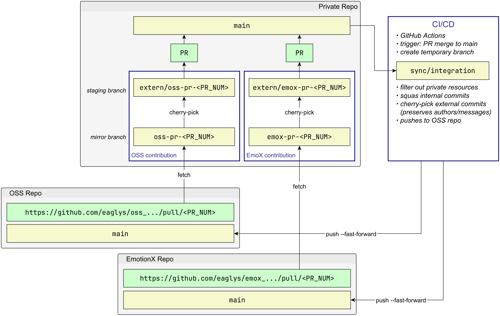

<<<<<<< HEAD
# Fake Eagly-TFHE 

* this is a fake repo to test (a) private -> OSS and (b) OSS -> private workflows
  *  [fake-eaglys-fhe.git](https://github.com/gpi-eaglys/fake-eaglys-fhe.git)  private repo
  *  [fake-eaglys-fhe-oss.git](https://github.com/gpi-eaglys/fake-eaglys-fhe-oss.git)  OSS repo


## Structure
* private repo: 
  * only internal members can edit this repo 
  * some parts of source code/documentation is private: should not be visible in the public repo \
    -> everything under the `internal/` dir
    -> scripts with prefix `internal-`
  * repo history is NOT public:
    * PRs, branches
    * individual commits and commit messages

```
fake-eaglys-fhe
├── github/workflows
│   └── internal-sync-to-oss.yml  # file filtered out in OSS sync
├── internal                      # dir filtered out in OSS sync
│   └── src
└── src
    ├── cndarray
    ├── high
    └── low
        ├── ...
        └── torus_polynomial
```

* OSS repo:
   * public GitHub repository 
   * users can create tickets, branches and PRs
   * cannot merge PRs themselves
   * PRs gets synced with internal repo, and merged there

* merge: OSS to private
  * PRs in the OSS repository are pulled into private repo 
  * now as internal PRs, they go through a manual review (enforced by GitHub settings)
  * PRs merged into main
* preserve author and commit of the original PR 

* merge: private to OSS
  * changes in the private main branch are pushed into OSS' main branch
  * authors and commit details are hidden (squashed) for security reasons


## Process Overview 




# Private-to-OSS Sync

## Setup: GitHub Actions 
* sync to OSS is triggered automatically by CI/CD
   * trigger: a PR merged to `main` branch 
   * a simple push to `main` does NOT trigger sync
   * there is no sync script -> cannot be triggered manually
* the sync process is implemented as a GitHub action

## Setup: Deploy key

### Generete deploy key pair 
  * use dedicated user for this task, e.g., `sync-bot`
  * produces: (a) `sync_deploy_key` and (b) `sync_deploy_key.pub`

```
ssh-keygen -t ed25519 -C "sync-bot" -f sync_deploy_key -N ""
```

###  Private key: add to private repo
* open GitHub repo: `fake-eaglys-fhe` 
* **Settings -> Secrets and veriables -> Actions -> New**
* paste contents of `sync_deploy_key`


###  Public key: add to OSS repo
* open GitHub repo: `fake-eaglys-fhe-oss` 
* **Settings -> Deploy keys -> Add deploy key**
* paste contents of `sync_deploy_key.pub`


# OSS-to-Private Sync

## Add OSS as a remote origin to the private repo
* in a localy workdir of private repo `fake-eaglys-fhe.git`
* add OSS repo as remote branch `oss` 
```
git remote add oss git@github.com:YOUR_USERNAME/fake-eaglys-fhe-oss.git
git fetch oss
``` 

* if there is PR in the OSS repo 
  * do not work on the PR on the OSS repo
  * pull the PR into the private repo
```
$ git fetch oss
Unpacking objects: 100% (86/86), 57.40 KiB | 288.00 KiB/s, done.
From github.com:gpi-eaglys/fake-eaglys-fhe-oss
 * [new branch]      feat/oss-pr1 -> oss/feat/oss-pr1
 * [new branch]      main         -> oss/main
```

* open PR on GitHub -> check pull request URL -> check PR serial number (below: `1`) 
```
https://github.com/gpi-eaglys/fake-eaglys-fhe-oss/pull/1
```


##  Pull PR branch to private repo
* in a localy work dir of private repo `fake-eaglys-fhe.git`
* if a PR is opened in the OSS repo -> pull it into the private repo
* check PR's serial number: e.g., `pull/1` -> `1` 
* locally name the PR e.g., `oss-pr-<PR_NUM>`

```
$ git fetch oss pull/<PR_NUM>/head:oss-pr-<PR_NUM>
```
* in case `PR_NUM=1` -> fetches onto `oss-pr-1`

```
$ git fetch oss pull/1/head:oss-pr-1
From github.com:gpi-eaglys/fake-eaglys-fhe-oss
 * [new ref]         refs/pull/1/head -> oss-pr-1
kinoko@LPC-0081:~/GIT/eaglys/fake-eaglys-fhe$ git branch -a
* main
  oss-pr-1                    <-   OSS pull request!!!
```

##  Update PR branch to private repo
* cannot repeat the fetch command above: `git fetch oss pull...` -> will error out
* force-update is possible with `+pull`
```
git fetch oss +pull/1/head:oss-pr-1
```
* check PR commit hash - using the local branch name
```
git rev-parse oss-pr-1
```

##  Create staging branch in private repo 
* a staging branch needs to be created 
* in order to fix issues or remove unnecessary changes
* naming
   * preserve original name 
   * sill convey that this is a staging branch

```
git checkout main
git pull origin main
git checkout -b extern/oss-pr-1     
``` 

* do NOT use `merge` but `cherry-pick`

```
git cherry-pick oss-pr-1
```

* this will introduce some errors
* fix conflicts manually 

```
git cherry-pick --continue
```

* push 
```
git push -u origin extern/oss-pr-1
``` 


##  Create PR in private repo from OSS PR branch 
* create PR local to private repo
* label this PR `oss-import` — this is how the sync workflow recognizes ALL of
  its commits as external (preserving their original authors) instead of
  squashing them in as anonymous internal changes
* continue modifying this branch
* merge using **"Create a merge commit"** — not squash, not rebase. The sync
  workflow tags the merge commit itself, so it needs the two parents a real
  merge commit has to recover the PR's original commits. (Squash/rebase
  merging should be disabled repo-wide: Settings -> General -> Pull Requests.)
* merging -> will trigger sync with OSS repo


##  Close OSS PR -> add courtesy note
* on the OSS PR page -> close the PR
* give credit to the author of the OSS PR — thanks to the `oss-import` label
  above, the OSS repo *does* preserve the original author on each of their
  commits (not just the fact that a sync happened)

```
Thank you Dude for your contribution! 
Your PR was merged internally as <commit-sha> — and will appear in this repo automatically!
```


2 directories, 1 file
=======
# fake-eaglys-tfhe
>>>>>>> 145b277 (Initial commit)
